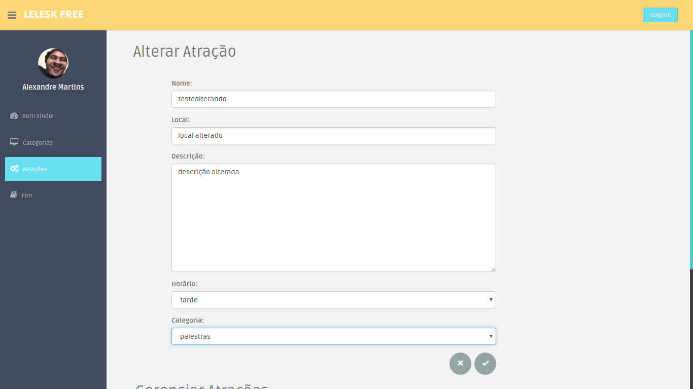

# t2 de si 2016/01
Alexandre Olinda Martins
13/0004901
Single page aplication que implementa um crud básico com relacionamento e sistema de login, para a matéria de Sistemas de Informação na Universidade de Brasília.

